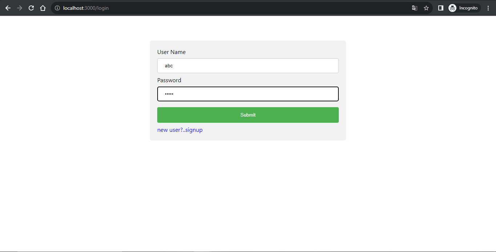
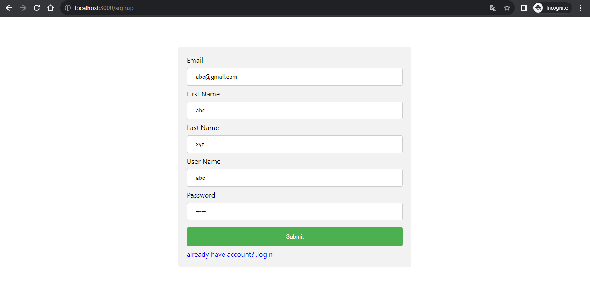
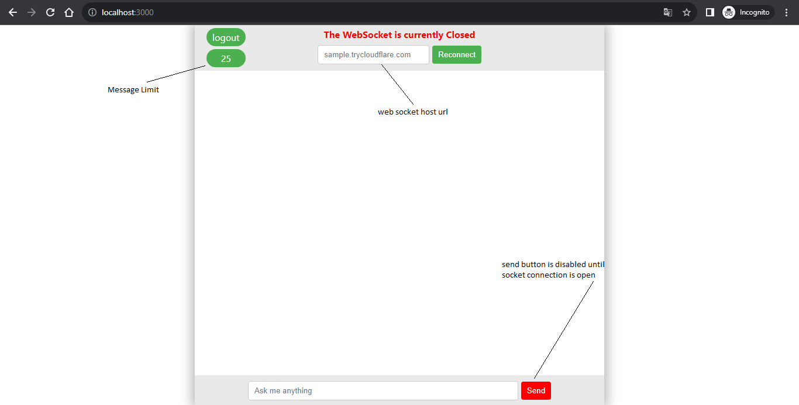
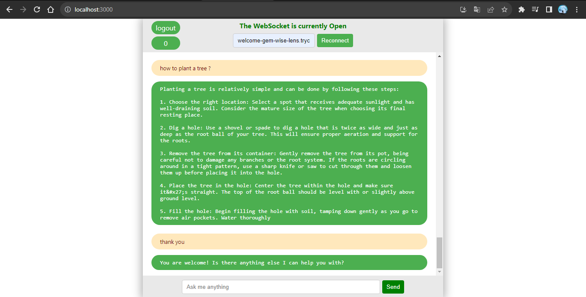
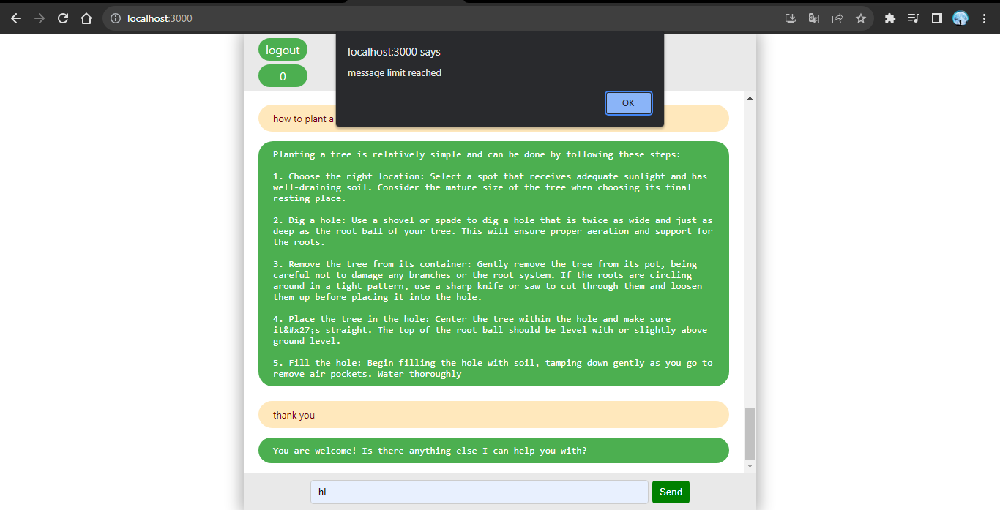

# run-your-gpt - Instructions for setting up and running the application

<h2>Clone the repo</h2>

step 1: use below cammand to clone the repo

<pre>
git clone https://github.com/shashanknaik0/run-your-gpt-frontend.git
</pre>

step 2: get into the directory
<pre>
cd run-your-gpt-frontend
</pre>

<h2>Install dependecies</h2>

step 1: use below cammand install dependecies from <code>package.json</code>
<pre>
npm install
</pre>

<h2>Setup the backend</h2>

use <a href="https://github.com/shashanknaik0/run-your-gpt-backend.git">this</a> link to setup backend, instructions are given in that repo.

<h2>Run the project</h2>

use below cammand to run app in localhost.
<pre>
npm start
</pre>

<h2>Result</h2>

<h4>Login page</h4>

<h4>Signup page</h4>

<h4>Ai chat page</h4>

Run  Ai model to get web socket URL ("wss://smaple.trycloudflare.com/api/v1/stream" if this is the public url only use "smaple.trycloudflare.com" part in input field)

when msg limit is reached it will give alert

